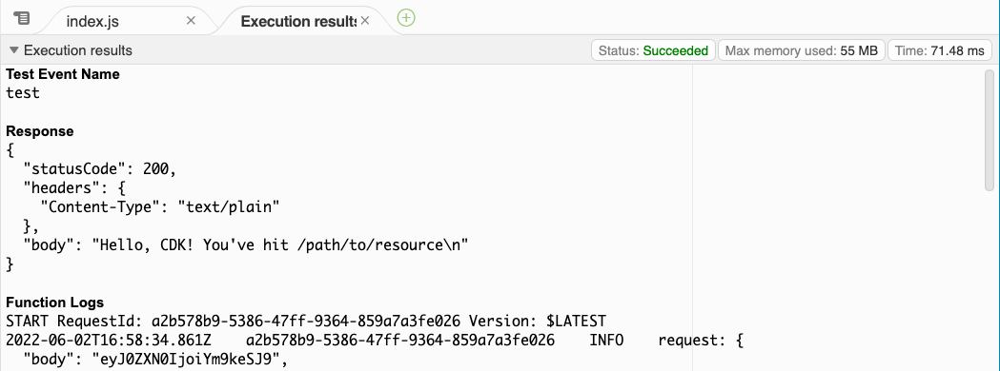

+++
title = "Hello Lambda"
weight = 200
+++

## Lambda handler のコード

まずは、Lambda handlerのコードから書いていきます。

1. プロジェクトツリーの最上位のディレクトリ (`bin`、`lib` ディレクトリと同階層 ) に `lambda` ディレクトリを作成します。

2. `lambda/hello.js` を作成して以下のコードを追加します。

---
```js
exports.handler = async function(event) {
  console.log("request:", JSON.stringify(event, undefined, 2));
  return {
    statusCode: 200,
    headers: { "Content-Type": "text/plain" },
    body: `Hello, CDK! You've hit ${event.path}\n`
  };
};
```

これは、__「Hello, CDK! You’ve hit [url path]」__ というテキストを返す単純なLambda関数です。HTTPステータスコードとHTTPヘッダーが付加されたHTTPレスポンスとしてユーザーに応答するために、API Gatewayを使用します。

{}
この Lambda 関数は JavaScript で実装されています。その他の言語での実装については [AWS Lambda のドキュメント](https://docs.aws.amazon.com/lambda/latest/dg/welcome.html)を参照してください。
{}

また、もし __git__ を使用する場合は、`.gitignore` ファイルに `！lambda/*.js` を追加することを検討してください。

## AWS Lambda コンストラクトライブラリをインストールする

AWS CDK には、__AWS Construct Library__ と呼ばれるコンストラクトのための広範なライブラリが付属しています。AWS Construct Library は、AWS のサービスごとに独立した __モジュール__ として提供されます。たとえば、AWS Lambda関数を定義する場合、AWS Lambda の Construct Library を使用する必要があります。

AWS コンストラクトについて学ぶには、[AWS Construct Library reference](https://docs.aws.amazon.com/cdk/api/v2/docs/aws-construct-library.html) を参照してください。


## コピー＆ペーストは使わずにコードを書いてみましょう

このワークショップでは、コピー&ペーストをするのではなく、実際に CDK のコードを入力することを強く推奨します（通常、入力する量は多くありません）。これにより、CDK の使い方についてより理解していただけるものとなります。さらに、IDE がオートコンプリート、インラインドキュメント及びタイプセーフに対応していることをご理解いただけるでしょう。


## AWS Lambda 関数をスタックに追加する

`import` ステートメントを `lib/cdk-workshop-stack.ts` の冒頭に挿入し、`lambda.Function` をスタックに追加します。



import * as cdk from 'aws-cdk-lib';
import * as lambda from 'aws-cdk-lib/aws-lambda';

export class CdkWorkshopStack extends cdk.Stack {
  constructor(scope: cdk.App, id: string, props?: cdk.StackProps) {
    super(scope, id, props);

    // defines an AWS Lambda resource
    const hello = new lambda.Function(this, 'HelloHandler', {
      runtime: lambda.Runtime.NODEJS_14_X,    // execution environment
      code: lambda.Code.fromAsset('lambda'),  // code loaded from "lambda" directory
      handler: 'hello.handler'                // file is "hello", function is "handler"
    });
  }
}


注目すべきいくつかの点：

- この関数は NodeJS (`NODEJS_14_X`) ランタイムを使用します。
- ハンドラーのコードは、先程作った `lambda` ディレクトリからロードされます。パスは、プロジェクトのルートディレクトリである `cdk` コマンド実行する場所からの相対パスです。
- ハンドラー関数の名前は `hello.handler` （「hello」はファイル名、「handler」は関数名です）

## コンストラクト (constructs) と コンストラクター (constructors) について

ご覧のとおり、両方のクラスコンストラクター `CdkWorkshopStack`、 `lambda.Function` (およびCDKの他の多くのクラス) には、シグネチャ `(scope, id, props)` が含まれています。 これらのすべては __コンストラクト__ であるため、 CDK アプリケーションの基本的な構成要素となっています。 それらは、スコープを介してより高いレベルの抽象化にまとめることができる抽象的な「クラウドコンポーネント」を表します。 スコープにはコンストラクトを含めることができ、そのコンストラクトには他のコンストラクトなどを含めることができます。


コンストラクトは常に別のコンストラクトのスコープ内で作成され、作成されたスコープ内で一意でなければならない識別子を常に持っている必要があります。したがって、コンストラクト初期化子（コンストラクター）には常に次のシグネチャが必要です。

1. __`scope`__: 最初の引数には、この構成が作成されるスコープを必ず指定します。ほとんどすべての場合、__現在__ のコンストラクトスコープ内でコンストラクトを定義することになります。つまり、通常 `this` は最初の引数に渡すだけです 。
2. __`id`__: 2番目の引数は、コンストラクトの __ローカルID__ です。これは、同じスコープ内のコンストラクト間で一意である必要があるIDです。CDK はこの ID を使用して、このスコープ内で定義された各リソースの CloudFormation の[論理 ID](https://docs.aws.amazon.com/AWSCloudFormation/latest/UserGuide/resources-section-structure.html) を計算します。CDK の ID の詳細については、[CDKユーザーマニュアル](https://docs.aws.amazon.com/cdk/latest/guide/identifiers.html#identifiers_logical_ids)を参照してください。
3. __`props`__: 最後の（場合によってはオプションの）引数は、初期化プロパティのセットです。これらは各コンストラクトに固有です。たとえば、`lambda.Function` コンストラクトは `runtime`、`code`、`handler` のようなプロパティを受け入れます。IDE のオートコンプリートまたは[オンラインドキュメント](https://docs.aws.amazon.com/cdk/api/latest/docs/aws-lambda-readme.html)を使用して、さまざまなオプションを調べられます。

## 差分

コードを保存し、デプロイする前に差分を見てみましょう。

```
cdk diff
```

出力は次のようになります。

```text
Stack CdkWorkshopStack
IAM Statement Changes
┌───┬─────────────────────────────────┬────────┬────────────────┬──────────────────────────────┬───────────┐
│   │ Resource                        │ Effect │ Action         │ Principal                    │ Condition │
├───┼─────────────────────────────────┼────────┼────────────────┼──────────────────────────────┼───────────┤
│ + │ ${HelloHandler/ServiceRole.Arn} │ Allow  │ sts:AssumeRole │ Service:lambda.amazonaws.com │           │
└───┴─────────────────────────────────┴────────┴────────────────┴──────────────────────────────┴───────────┘
IAM Policy Changes
┌───┬─────────────────────────────┬────────────────────────────────────────────────────────────────────────────────┐
│   │ Resource                    │ Managed Policy ARN                                                             │
├───┼─────────────────────────────┼────────────────────────────────────────────────────────────────────────────────┤
│ + │ ${HelloHandler/ServiceRole} │ arn:${AWS::Partition}:iam::aws:policy/service-role/AWSLambdaBasicExecutionRole │
└───┴─────────────────────────────┴────────────────────────────────────────────────────────────────────────────────┘
(NOTE: There may be security-related changes not in this list. See https://github.com/aws/aws-cdk/issues/1299)

Parameters
[+] Parameter AssetParameters/3342065582ab8a3599385f447c9f5d5b141c726eb5dc468594ec8450a97f3cb7/S3Bucket AssetParameters3342065582ab8a3599385f447c9f5d5b141c726eb5dc468594ec8450a97f3cb7S3BucketEB5CA0D6: {"Type":"String","Description":"S3 bucket for asset \"3342065582ab8a3599385f447c9f5d5b141c726eb5dc468594ec8450a97f3cb7\""}
[+] Parameter AssetParameters/3342065582ab8a3599385f447c9f5d5b141c726eb5dc468594ec8450a97f3cb7/S3VersionKey AssetParameters3342065582ab8a3599385f447c9f5d5b141c726eb5dc468594ec8450a97f3cb7S3VersionKeyC5F120D1: {"Type":"String","Description":"S3 key for asset version \"3342065582ab8a3599385f447c9f5d5b141c726eb5dc468594ec8450a97f3cb7\""}
[+] Parameter AssetParameters/3342065582ab8a3599385f447c9f5d5b141c726eb5dc468594ec8450a97f3cb7/ArtifactHash AssetParameters3342065582ab8a3599385f447c9f5d5b141c726eb5dc468594ec8450a97f3cb7ArtifactHashBAACCCD2: {"Type":"String","Description":"Artifact hash for asset \"3342065582ab8a3599385f447c9f5d5b141c726eb5dc468594ec8450a97f3cb7\""}

Resources
[+] AWS::IAM::Role HelloHandler/ServiceRole HelloHandlerServiceRole11EF7C63
[+] AWS::Lambda::Function HelloHandler HelloHandler2E4FBA4D
```

上記のとおり、このコードから __AWS::Lambda::Function__ リソース用のCloudFormationテンプレートを生成しました。また、ツールキットがハンドラーコードの場所を伝達するためにいくつかの [CloudFormation パラメータ](https://docs.aws.amazon.com/ja_jp/cdk/v2/guide/parameters.html) を利用しています。


## デプロイ

次にデプロイをします。

```
cdk deploy
```

`cdk deploy` を実行すると、CloudFormationスタックをデプロイするだけでなく、初期構築した S3 バケットに対して、ローカルの `lambda` ディレクトリを圧縮後、アップロードしていることがが分かるでしょう。

## Lambda 関数のテスト

AWS Lambda コンソールに移動して、Lambda 関数をテストしましょう。

1. [AWS Lambda
   Console](https://console.aws.amazon.com/lambda/home#/functions) を開きます (正しいリージョンにいることを確認してください)。

    Lambda 関数が表示されます。

    

2. 関数名をクリックして、コンソールを移動します。

3. `Test` ボタン横の `▼` をクリックして、 テストイベントの設定 ダイアログを開きます。

    

4. __テンプレート__ リストから __API Gateway AWS Proxy__ を選択します。


5. イベント名 に __test__ を入力します。

    

6. __保存__ をクリックします。

7. __Test__ をクリックし、実行が完了するまで待ちます。


8. __Execution results__ ペインで出力が表示されます。

    

# 👏
