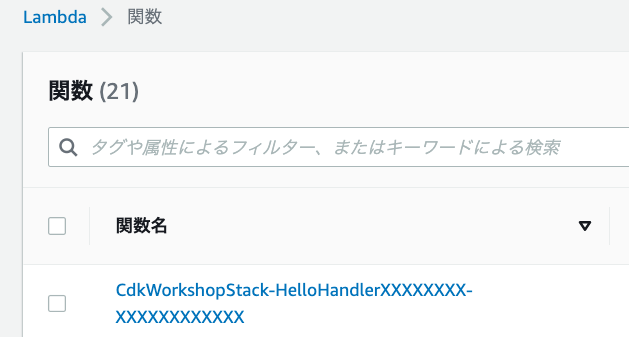

+++
title = "CDK Watch"
weight = 300
+++

## 高速な開発

{} このセクションは必須ではありませんが、`cdk deploy —-hotswap` と `cdk watch` がデプロイをどのようにスピードアップできるか確認することをお勧めします。
{}

Lambda 関数が機能しているのは素晴らしいことですが、`"Hello, CDK"` の代わりに `"Good Morning, CDK!"` で応答させるよう Lambda 関数のコードを微調整してみましょう。

スタックを更新するために使うコマンドは `cdk deploy` ですが、CloudFormation スタックをデプロイし、「lambda」ディレクトリをブートストラップバケットにアップロードする必要があり時間がかかりすぎます。Lambda 関数のコードを変更するだけなら、CloudFormation スタックを実際に更新する必要はないので、`cdk deploy` の一部の時間は本来不要です。

Lambda 関数のコードの更新だけを行うための仕組みがあったらいいですよね？

## `cdk deploy` の時間

まず、`cdk deploy` の実行にかかる時間を計りましょう。CloudFormation のデプロイを完了させるためにかかる時間が参考になります。そのために、`lambda/hello.js` 内のコードを変更します。


exports.handler = async function(event) {
  console.log("request:", JSON.stringify(event, undefined, 2));
  return {
    statusCode: 200,
    headers: { "Content-Type": "text/plain" },
    body: `Good Morning, CDK! You've hit ${event.path}\n`
  };
};


これで `cdk deploy` を実行することができます。

```
cdk deploy
```

出力は次のようになります。

```
✨  Synthesis time: 6s

CdkWorkshopStack: deploying...
CdkWorkshopStack: creating CloudFormation changeset...


 ✅  CdkWorkshopStack

✨  Deployment time: 66.82s

Stack ARN:
arn:aws:cloudformation:REGION:ACCOUNT-ID:stack/CdkWorkshopStack/STACK-ID

✨  Total time: 72.82s
```

おおよその通常の CloudFormation のデプロイにかかる時間が分かりました。
## ホットスワップデプロイ

{} このコマンドは、デプロイを高速化するために CloudFormation スタックにドリフトを意図的に発生させます。このため、開発目的でのみ使用してください。実稼働環境ではホットスワップを使用しないでください！
{}

デプロイ時間を短縮するために利用する `cdk deploy —-hotswap` では、CloudFormation デプロイの代わりにホットスワップデプロイを実行できるかどうかを評価します。可能であれば、CDK CLI は AWS サービス API を使用して直接変更を行います。それ以外の場合は、CloudFormation の完全なデプロイの実行にフォールバックします。

ここでは、`cdk deploy —-hotswap` を使用して、ホットスワップ可能な変更を AWS Lambda アセットコードにデプロイします。

## `cdk deploy --hotswap`の時間

`lambda/hello.js` の Lambda 関数のコードをもう一度変更してみましょう


exports.handler = async function(event) {
  console.log("request:", JSON.stringify(event, undefined, 2));
  return {
    statusCode: 200,
    headers: { "Content-Type": "text/plain" },
    body: `Good Afternoon, CDK! You've hit ${event.path}\n`
  };
};


`cdk deploy --hotswap`を実行します。

```
cdk deploy --hotswap
```

出力は次のようになります。

```
✨  Synthesis time: 6.44s

⚠️ The --hotswap flag deliberately introduces CloudFormation drift to speed up deployments
⚠️ It should only be used for development - never use it for your production Stacks!

CdkWorkshopStack: deploying...
✨ hotswapping resources:
   ✨ Lambda Function 'CdkWorkshopStack-HelloHandler2E4FBA4D-tEZTcXqG8YYe'
✨ Lambda Function 'CdkWorkshopStack-HelloHandler2E4FBA4D-tEZTcXqG8YYe' hotswapped!

 ✅  CdkWorkshopStack

✨  Deployment time: 3.07s

Stack ARN:
arn:aws:cloudformation:REGION:ACCOUNT-ID:stack/CdkWorkshopStack/STACK-ID

✨  Total time: 9.51s
```

CloudFormation のデプロイが完了するには 67秒かかったのに対し、ホットスワップされた変更をデプロイするのにかかったのは 3秒です。
警告メッセージをよく見てください。非常に重要です！（開発目的でのみ使用してください。実稼働環境ではホットスワップを使用しないでください！）

```
⚠️ The --hotswap flag deliberately introduces CloudFormation drift to speed up deployments
⚠️ It should only be used for development - never use it for your production Stacks!
```

## コードは本当に変更されているのか？

Wow that was fast. Did the code actually change? Let's go to the AWS Lambda Console and
double check!

## コードは本当に変更されているのか？

デプロイは速かったですが、コードは実際に変更されているでしょうか？ AWS Lambda コンソールに移動して、確認してみましょう。

1. [AWS Lambda Console](https://console.aws.amazon.com/lambda/home#/functions) を開きます。(正しいリージョンにいることを確認してください)

    Lambda 関数が表示されます。

    

2. 関数名をクリックして、コンソールを移動します。

3. コードが画面に読み込まれます。コードは変更されていますか？

    

## CDK Watch

`cdk watch` は 毎回 `cdk deploy` または `cdk deploy -—hotswap` を呼び出すよりも便利です。。`cdk deploy` に似ていますが、ワンショット操作ではなく、コードとアセットに変更がないか監視し、変更が検出されると自動的にデプロイを試みます。デフォルトでは、`cdk watch` は `—-hotswap` フラグを使います。変更内容を調べて、ホットスワップできるかどうかを判断します。`cdk watch —-no-hotswap` を呼び出すと、ホットスワップ動作が無効になります。

一度設定したら、`cdk watch`を使用して、ホットスワップ可能な変更と、完全な CloudFormation デプロイを必要とする変更の両方を検出できます。

## `cdk.json` ファイルを修正する

When the `cdk watch` command runs, the files that it observes are determined by the
`"watch"` setting in the `cdk.json` file. It has two sub-keys, `"include"` and
`"exclude"`, each of which can be either a single string or an array of strings.
Each entry is interpreted as a path relative to the location of the `cdk.json`
file. Globs, both `*` and `**`, are allowed to be used.

Your `cdk.json` file should look similar to this:

`cdk watch` コマンドが実行されると、監視するファイルは `cdk.json` ファイルの `"watch"` 設定によって決定されます。
監視するファイルは `cdk.json` ファイルにある `"watch"` 設定によって決定されます。
この設定には2つのサブキー、 `"include"` と `"exclude"` があり、それぞれ単一の文字列または文字列の配列で指定します。
各エントリーは、`cdk.json` ファイルの場所からの相対パスとして解釈されます。
またグロブパターンとして、`*` と `**` の両方を使用することができます。

`cdk.json` ファイルを開くと以下のような設定があります。

```json
{
  "app": "npx ts-node --prefer-ts-exts bin/cdk-workshop.ts",
  "watch": {
    "include": [
      "**"
    ],
    "exclude": [
      "README.md",
      "cdk*.json",
      "**/*.d.ts",
      "**/*.js",
      "tsconfig.json",
      "package*.json",
      "yarn.lock",
      "node_modules",
      "test"
    ]
  },
  "context": {
    // ...
  }
}
```

ご覧の通り、サンプルアプリには推奨の `"watch"` の設定が付随しています。
今回は、`lambda` フォルダにある `.js` ファイルを監視したいので、 `"**/*.js"` を `"exclude"` リストから削除してみましょう。
`"**/*.js"` を `"exclude"` リストから削除します。

```json
{
  "app": "npx ts-node --prefer-ts-exts bin/cdk-workshop.ts",
  "watch": {
    "include": [
      "**"
    ],
    "exclude": [
      "README.md",
      "cdk*.json",
      "**/*.d.ts",
      "tsconfig.json",
      "package*.json",
      "yarn.lock",
      "node_modules",
      "test"
    ]
  },
  "context": {
    // ...
  }
}
```

それでは試してみましょう。

## `cdk watch` の時間

はじめに `cdk watch` を呼び出します。

```
cdk watch
```

This will trigger an initial deployment and immediately begin observing the files
we've specified in `cdk.json`.

Let's change our lambda asset code in `lambda/hello.js` one more time:


exports.handler = async function(event) {
  console.log("request:", JSON.stringify(event, undefined, 2));
  return {
    statusCode: 200,
    headers: { "Content-Type": "text/plain" },
    body: `Good Night, CDK! You've hit ${event.path}\n`
  };
};


Once you save the changes to your Lambda code file, `cdk watch` will recognize that
your file has changed and trigger a new deployment. In this case, it will recognize
that we can hotswap the lambda asset code, so it will bypass a CloudFormation
deployment and deploy directly to the Lambda service instead.

How fast did deployment take?

```
Detected change to 'lambda/hello.js' (type: change). Triggering 'cdk deploy'

✨  Synthesis time: 5.57s

⚠️ The --hotswap flag deliberately introduces CloudFormation drift to speed up deployments
⚠️ It should only be used for development - never use it for your production Stacks!

CdkWorkshopStack: deploying...
✨ hotswapping resources:
   ✨ Lambda Function 'CdkWorkshopStack-HelloHandler2E4FBA4D-tEZTcXqG8YYe'
✨ Lambda Function 'CdkWorkshopStack-HelloHandler2E4FBA4D-tEZTcXqG8YYe' hotswapped!

 ✅  CdkWorkshopStack

✨  Deployment time: 2.54s

Stack ARN:
arn:aws:cloudformation:REGION:ACCOUNT-ID:stack/CdkWorkshopStack/STACK-ID

✨  Total time: 8.11s
```

## Wrap Up

The rest of this tutorial will continue using `cdk deploy` instead of `cdk watch`.
But if you want to, you can simply keep `cdk watch` on. If you need to make a full
deployment, `cdk watch` will call `cdk deploy` for you.

For a deeper dive on `cdk watch` use cases, read
[Increasing Development Speed with CDK Watch](https://aws.amazon.com/blogs/developer/increasing-development-speed-with-cdk-watch/).