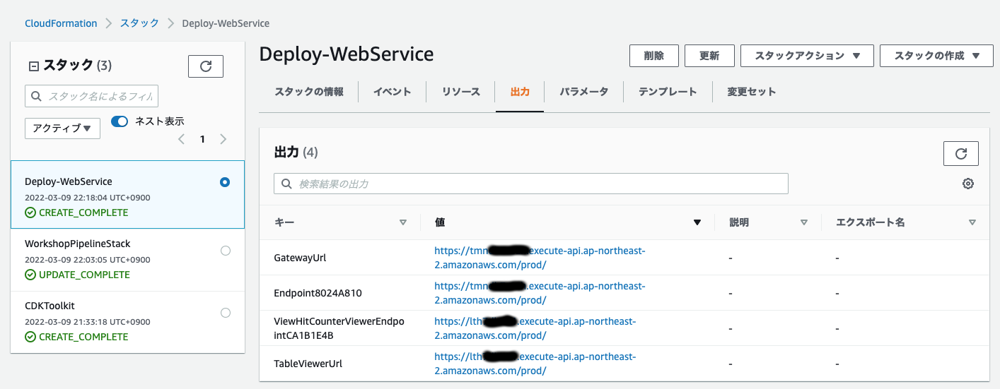

+++
title = "パイプラインの改善"
weight = 150
+++

## エンドポイントの取得
よく考えると、アプリケーションがパイプラインに自動的にデプロイされることによって一つ課題が発生します。
アプリケーションのエンドポイント (`TableViewer` と `LambdaRestApi`) を簡単に取得できる方法がありません。
それらを明確に公開するために少しのソースコードを追加しましょう。

まずは、`clib/cdk-workshop-stack.ts` を編集して、スタックのプロパティとして公開するようにします。


import * as cdk from 'aws-cdk-lib';
import * as lambda from 'aws-cdk-lib/aws-lambda';
import * as apigw from 'aws-cdk-lib/aws-apigateway';
import { Construct } from 'constructs';
import { HitCounter } from './hitcounter';
import { TableViewer } from 'cdk-dynamo-table-viewer';

export class CdkWorkshopStack extends cdk.Stack {
  public readonly hcViewerUrl: cdk.CfnOutput;
  public readonly hcEndpoint: cdk.CfnOutput;

  constructor(scope: Construct, id: string, props?: cdk.StackProps) {
    super(scope, id, props);

    const hello = new lambda.Function(this, 'HelloHandler', {
      runtime: lambda.Runtime.NODEJS_14_X,
      code: lambda.Code.fromAsset('lambda'),
      handler: 'hello.handler',
    });

    const helloWithCounter = new HitCounter(this, 'HelloHitCounter', {
      downstream: hello
    });

    // defines an API Gateway REST API resource backed by our "hello" function.
    const gateway = new apigw.LambdaRestApi(this, 'Endpoint', {
      handler: helloWithCounter.handler
    });

    const tv = new TableViewer(this, 'ViewHitCounter', {
      title: 'Hello Hits',
      table: helloWithCounter.table,
      sortBy: '-hits'
    });

    this.hcEndpoint = new cdk.CfnOutput(this, 'GatewayUrl', {
      value: gateway.url
    });

    this.hcViewerUrl = new cdk.CfnOutput(this, 'TableViewerUrl', {
      value: tv.endpoint
    });
  }
}


`hcViewerUrl` と `hcEnpoint` の出力を追加することで、HitCounter アプリケーションに必要なエンドポイントを公開します。
そのために、`CfnOutput` コアコンストラクトを使用して、その出力を Cloudformation スタックの出力として宣言しています (後ほど説明)。

今回の変更をリポジトリにコミットし (`git commit -am "MESSAGE" && git push`)、[ Cloudformation コンソール](https://console.aws.amazon.com/cloudformation) を開きます。スタックが 3つあります。

* `CDKToolkit`: こちらは統合 CDK スタックです (ブートストラップされたアカウントでは常に存在するはずです)。特に気にする必要がありません。
* `WorkshopPipelineStack`: こちらはパイプラインを定義するスタックです。今回確認したいものではありません。
* `Deploy-WebService`: こちらはアプリケーションです。このスタックの名前にクリックし、`出力` タブを選択します。4つのエンドポイント (重複した値 2組) が表示されます。そのうちの 2つ、`EndpointXXXXXX` と `ViewerHitCounterViewerEndpointXXXXXXX` は Cloudformation によってデフォルトで生成されていて、残りの 2つは明示的に宣言した出力になります。

出力 `TableViewerUrl` の値をクリックすると、最初のワークショップで作成した hitcounter テーブルが表示されます。

## バリデーションテストの追加
これでアプリケーションがデプロイされましたが、テストのない CD パイプラインは完成だとは言えません。

まず、エンドポイントが稼働しているかどうかを確認するために、簡単にアクセスするテストから始めましょう。
`lib/pipeline-stack.ts` に戻り、以下の通り変更を加えます。


import * as cdk from 'aws-cdk-lib';
import * as codecommit from 'aws-cdk-lib/aws-codecommit';
import { Construct } from 'constructs';
import {WorkshopPipelineStage} from './pipeline-stage';
import {CodeBuildStep, CodePipeline, CodePipelineSource} from "aws-cdk-lib/pipelines";

export class WorkshopPipelineStack extends cdk.Stack {
    constructor(scope: Construct, id: string, props?: cdk.StackProps) {
        super(scope, id, props);

        // PIPELINE CODE HERE...

        const deploy = new WorkshopPipelineStage(this, 'Deploy');
        const deployStage = pipeline.addStage(deploy);

        deployStage.addPost(
            new CodeBuildStep('TestViewerEndpoint', {
                projectName: 'TestViewerEndpoint',
                envFromCfnOutputs: {
                    ENDPOINT_URL: //TBD
                },
                commands: [
                    'curl -Ssf $ENDPOINT_URL'
                ]
            }),

            new CodeBuildStep('TestAPIGatewayEndpoint', {
                projectName: 'TestAPIGatewayEndpoint',
                envFromCfnOutputs: {
                    ENDPOINT_URL: //TBD
                },
                commands: [
                    'curl -Ssf $ENDPOINT_URL',
                    'curl -Ssf $ENDPOINT_URL/hello',
                    'curl -Ssf $ENDPOINT_URL/test'
                ]
            })
        )
    }
}


CDK パイプラインの `deployStage.addPost(...)` を使って 2つのステップを追加します。
デプロイステージに TableViewer エンドポイントと APIGateway エンドポイントをそれぞれテストする 2つのアクションを追加します。

> 注意 : 既にいくつかの値を持っている tableview を参照する APIGateway エンドポイントに対して `curl` リクエストを送信します

ソースコードには、それらのエンドポイントの URL をまだ設定していません。それは、このスタックにまだ公開されていないからです。

`lib/pipeline-stage.ts` を少し変更するだけで、エンドポイントを公開できます。


import { CdkWorkshopStack } from './cdk-workshop-stack';
import { Stage, CfnOutput, StageProps } from 'aws-cdk-lib';
import { Construct } from 'constructs';

export class WorkshopPipelineStage extends Stage {
    public readonly hcViewerUrl: CfnOutput;
    public readonly hcEndpoint: CfnOutput;

    constructor(scope: Construct, id: string, props?: StageProps) {
        super(scope, id, props);

        const service = new CdkWorkshopStack(this, 'WebService');

        this.hcEndpoint = service.hcEndpoint;
        this.hcViewerUrl = service.hcViewerUrl;
    }
}


これで、デプロイステージの `CfnOutput` を取得することで、`lib/pipeline-stack.ts` のアクションにそれらの値を追加できます。


    // CODE HERE...
    deployStage.addPost(
            new CodeBuildStep('TestViewerEndpoint', {
                projectName: 'TestViewerEndpoint',
                envFromCfnOutputs: {
                    ENDPOINT_URL: deploy.hcViewerUrl
                },
                commands: [
                    'curl -Ssf $ENDPOINT_URL'
                ]
                }),
            new CodeBuildStep('TestAPIGatewayEndpoint', {
                projectName: 'TestAPIGatewayEndpoint',
                envFromCfnOutputs: {
                    ENDPOINT_URL: deploy.hcEndpoint
                },
                commands: [
                    'curl -Ssf $ENDPOINT_URL',
                    'curl -Ssf $ENDPOINT_URL/hello',
                    'curl -Ssf $ENDPOINT_URL/test'
                ]
            })
        )


## コミットして、結果を確認
ソースコードの変更をコミットし、パイプラインがアプリケーションを再デプロイすることを待ちます。しばらくすると、[CodePipeline コンソール](https://console.aws.amazon.com/codesuite/codepipeline/pipelines) にてパイプラインの `Deploy` ステージ内に 2つのテストアクションが含まれていることを確認できます。

おめでとうございます！アプリケーションのテストも含む完璧な CD パイプラインを作成できました！興味があれば、コンソールで作成されたスタックの詳細を確認したり、[API リファレンス](https://docs.aws.amazon.com/cdk/api/latest/docs/aws-construct-library.html) の CDK パイプラインのセクションを確認しみてください。お持ちのアプリケーションにも CDK パイプラインを作ってみたらいかがでしょうか？
